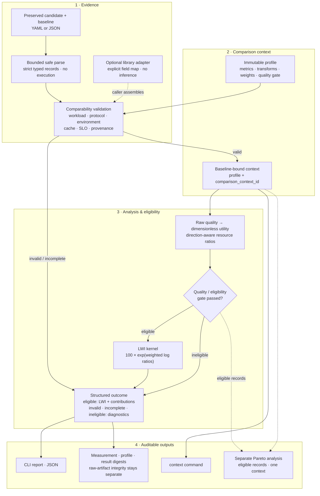

# LLM Weissman Index (LWI)

**LLM Weissman Index (LWI) has a deterministic scoring and context core.** It
is a workload-specific, baseline-relative quality-adjusted efficiency index
that compares a candidate system with an explicit baseline inside one versioned
workload, protocol, profile, and measurement context.

LWI is a reference implementation for preserved measurements. It does not run
model workloads, call provider APIs, download models, or claim to measure
general intelligence.

## Why it exists

Inference systems trade quality against latency, throughput, memory, cost, and
other deployment resources. LWI makes that trade explicit while refusing to
turn incompatible measurements or arbitrary benchmark scores into one
leaderboard number.

The baseline is **100** by definition. A score above 100 means that the
candidate has higher profile-weighted aggregate efficiency under the selected
context. It does not mean that the candidate wins on every dimension or is
generally smarter or better.

Scores from different workloads, baselines, profiles, protocol versions, or
quality transforms must not be ranked together. Every result includes a
deterministic `comparison_context_id` to make that boundary auditable.

## What makes LWI different

LWI combines these controls in one scoreable contract:

- **Comparability firewall**: a candidate cannot receive a portable score
  without an explicit baseline, workload, protocol, environment, and profile.
  The deterministic `comparison_context_id` prevents cross-context ranking.
- **Policy before arithmetic**: each immutable profile declares dimensions,
  directions, units, utility transforms, weights, gates, assumptions, and
  exclusions. Missing data stays `incomplete`; zero candidate utility stays
  `ineligible`; LWI never hides either case with reweighting or epsilon values.
- **Evidence-bound identity**: model artifact, quality context, execution
  system, and performance protocol remain separate. Mismatches become
  structured validation errors instead of silent assumptions.
- **Audit-ready output**: reports expose log-space contributions, quality-gate
  margins, warnings, provenance, public measurement digests, profile digests,
  and result digests. Report generation rechecks evaluation binding.
- **Scalar and Pareto views**: the scalar LWI summarizes a declared policy, while
  same-context Pareto analysis keeps task-level and resource trade-offs visible.
- **Performance semantics instead of one `throughput` field**: scenarios,
  latency semantics, cache state, SLO-bound goodput, operating points, and
  operating envelopes remain explicit and comparable.
- **Safe non-execution boundary**: bounded safe parsing, explicit field maps,
  output redaction, and default-deny live policy prevent the package from
  turning benchmark data into code or uncontrolled traffic.

This combination makes LWI a comparability and evidence layer, not another
leaderboard or benchmark runner.

## Quick start

```bash
uv sync --locked
uv run lwi validate examples/synthetic/comparison.yaml --profile profiles/edge-v1.yaml
uv run lwi compute examples/synthetic/comparison.yaml --profile profiles/edge-v1.yaml --json
uv run lwi report examples/synthetic/comparison.yaml --profile profiles/edge-v1.yaml
uv run lwi context examples/synthetic/comparison.yaml --profile profiles/edge-v1.yaml
uv run lwi pareto examples/synthetic/comparison.yaml --profile profiles/edge-v1.yaml --json
```

The normal local gate is:

```bash
uv lock --check
uv sync --locked
uv run ruff check .
uv run ruff format --check .
uv run pytest
uv build --no-sources
uv run python scripts/inspect_artifacts.py
```

## Architecture at a glance

The reference path is intentionally auditable: preserved candidate/baseline
evidence enters through bounded safe parsing. A library caller can normalize an
external artifact with an optional explicit, field-mapped importer, but the
importer does not create a `ComparisonInput` or run scoring. Comparability then
binds the workload, protocol, environment, provenance, baseline, and immutable
profile into a context ID.
Only comparable records reach quality/resource analysis and the eligibility
gate; invalid, incomplete, and ineligible records retain diagnostics without a
leaderboard-friendly LWI. Reports and digests remain separate from the
same-context Pareto command. CI build artifacts are a separate release lane,
not scoring outputs.



## Input and evidence contract

Every comparison has a candidate, a baseline, a workload, a protocol, two
system records, provenance, and a selected immutable profile. Typed structures
reject unknown fields; `workload` and `protocol` retain extensible metadata so
new benchmark context does not require a core-model rewrite.

LWI separates four identity surfaces:

- **Model artifact**: checkpoint or endpoint revision, weights, tokenizer,
  adapters, dtype, and quantization
- **Quality context**: dataset and split revisions, prompt and template
  digests, scorer or judge configuration, and grading epoch
- **Execution system**: runtime, hardware, device count, parallelism, serving
  settings, and cache policy
- **Performance protocol**: scenario, load process, warmup, statistic, workload
  shape, SLO, and failure/retry rules

Evidence classes describe origin, not truth. The validator distinguishes
`fixture`, `smoke`, and `publication` evidence. Publication performance records
need measured provenance, explicit model artifacts, and compatible operating
envelopes for both candidate and baseline. Disputed or missing facts remain
diagnostics instead of becoming a leaderboard score.

## Formula

For each quality task, LWI first maps the raw score to a documented bounded
dimensionless utility. Baseline utility must be positive. A candidate utility
of zero remains explicit and makes the evaluation `ineligible`; LWI does not
add an epsilon to manufacture a finite score. LWI then computes a weighted
geometric quality ratio:

```text
ln(RQ) = Σ_i v_i · ln(u_candidate_i / u_baseline_i)
```

For each lower-is-better resource `x`, `R = baseline / candidate`; for a
higher-is-better metric, `R = candidate / baseline`. The kernel is:

```text
LWI = 100 · exp(wQ · ln(RQ) + Σ_j wj · ln(Rj))
```

All weights are non-negative and sum to one. Missing required metrics are
`incomplete`; they are never silently reweighted. A quality gate can make a
result `ineligible` even when the measured quality and resource ratios are
available. The final score is a weighted aggregate of quality and resource
ratios, not a claim that every candidate dimension improved.

The implementation uses `Decimal` arithmetic and canonical unit conversion.
Each contribution records its ratio, weight, and weighted logarithm, so a
single extreme dimension cannot hide inside the final scalar.

## Quality and provenance

Raw benchmark scores are not assumed to be ratio-scale. Each profile declares
the scale type, direction, valid range, versioned utility transform, and
utility bounds. If no defensible transform exists, LWI refuses to score the
quality component.

Every observation carries units, statistic, and uncertainty fields where
available. Results preserve model revisions, benchmark revisions, environment
metadata, evidence class, source information, raw/config/environment digests,
profile digest, measurement digests, and result digest. A `measurement_digest`
is a domain-separated SHA-256 of the `normalized_public_record_v1`
representation after report redaction. It identifies the normalized public
record; it is not proof of raw-artifact integrity. Evaluation output reports
`raw_artifact_integrity: unavailable` unless raw bytes are verified separately.

## Released profiles

Profiles are immutable project policies, not natural laws. A semantic change
requires a new profile or specification version. The current profiles are:

| Profile | Weights | Required dimensions | Explicit boundary |
|---|---|---|---|
| `param-v1` | quality 0.70, total parameters 0.30 | `parameters_total` | Total parameters only; active or trainable counts cannot substitute |
| `edge-v1` | quality 0.55, latency 0.25, throughput 0.10, peak memory 0.10 | `latency`, `throughput`, `peak_memory` | Energy and cost are excluded |
| `api-v1` | quality 0.45, TTFT 0.20, E2E latency 0.15, cost 0.15, throughput 0.05 | `ttft`, `e2e_latency`, `cost_per_successful_task`, `throughput` | Provider hardware, hidden batching, and unknown parameters are excluded |

Quality transforms, directions, units, gates, assumptions, exclusions, and
profile digests are part of the score contract. Parameter totals, active
parameters, and trainable parameters remain separate fields. Disputed claims
are not silently resolved.

See the formal specification in [`spec/LWI-SPEC.md`](spec/LWI-SPEC.md), the
[methodology](docs/methodology.md), the [quality transforms](docs/quality-transforms.md),
the [benchmark protocol](docs/benchmark-protocol.md), and the synthetic and
[GLiNER2.5-Decide examples](examples/).

## Reports, digests, and interpretation

Reports show raw candidate/baseline observations, canonical units, resource
ratios, quality utilities, retention, gate margin, warnings, evidence classes,
normalized-public measurement digests, and the result digest. Human output is
rounded for readability; JSON retains Decimal strings and never rounds
intermediate ratios. A normalized-public digest must not be read as saying that
two raw artifacts are identical after redaction.

Eligible results also expose a log-space contribution ledger: each dimension
reports its ratio, weight, and `weight * ln(ratio)`, followed by the sum. This is
an audit aid, not an additional score. `uncertainty_status` reflects confidence
and bounds on the quality and top-level metric observations currently included
in scoring. It is not aggregate uncertainty propagation and does not cover
every parameter or operating-envelope observation.

## Performance evidence and goodput

Performance evidence is explicit rather than a generic `throughput` context.
Use `offline`, `open_loop`, or `closed_loop` scenarios and preserve observed
`OperatingPoint` and `OperatingEnvelope` records. `TTFT`, `TPOT`, `ITL`, queue,
and E2E latency are separate semantics. Cache state, token shape, client
headroom, failures, and retries remain visible.

LWI separates three performance cases:

- **Trace-derived goodput**: `compute_goodput()` evaluates preserved
  `RequestTrace` records against an explicit `SLO`. It does not infer missing
  requests or interpolate points.
- **Preserved operating-point evidence**: an `OperatingPoint` can carry a
  supplied `goodput` and its `goodput_slo`. LWI validates the shape and
  provenance of that evidence, but does not independently recompute it without
  request traces.
- **LWI score inputs**: the scalar score currently reads the profile's
  top-level system metrics. Operating envelopes support compatibility,
  publication gates, observed-point warnings, and reporting; they are not
  automatically converted into score metrics or curves.

Retries remain a separate count. The trace-derived `attempted_count` counts
  preserved request records, while `retry_count` records retry activity.
Interpolated points are retained for context but excluded from default observed
point analysis.

Explicit live activation is also a preflight, not a load generator. The
`LiveBenchmarkPolicy` requires an exact HTTPS allowlist and performs DNS
resolution to reject failures, empty answers, and non-global addresses. It does
not send HTTP traffic. The JSON Schema provides syntax checks; runtime semantic
validation remains authoritative.

Scalar LWI is a convenience layer. When multiple eligible records share one
context, `lwi pareto comparison_a.yaml comparison_b.yaml --profile PROFILE`
exposes reusable dominance flags over quality utilities and normalized resource
ratios. It refuses incompatible contexts.

## CLI and Python API

The `lwi` command exposes the complete reference workflow:

| Command | Purpose | Success and failure behavior |
|---|---|---|
| `validate` | Parse and semantically validate one comparison | `0` valid, `1` validation errors, `2` input errors |
| `compute` | Emit the bound evaluation and scalar result | `0` eligible, `3` incomplete/ineligible/invalid evaluation, `2` input errors |
| `report` | Render a human report or JSON document | Same evaluation exit codes as `compute` |
| `context` | Emit the deterministic comparison context | `0` valid context, `1` invalid comparison, `2` input errors |
| `pareto` | Compare multiple eligible records in one context | `0` success, `2` input errors, `3` ineligible or incompatible inputs |

`validate` defaults to `edge-v1`; the other commands require `--profile`.
Use `--json` for machine-readable output. The library exports
`ComparisonInput`, `Measurement`, `compute_lwi`, `SLO`, `GoodputResult`,
`OperatingPoint`, `OperatingEnvelope`, `compute_goodput`,
`LiveBenchmarkPolicy`, and the explicit importer adapter.

```python
from llm_weissman import SLO, compute_goodput
from llm_weissman.performance import RequestTrace

slo = SLO.from_dict({"e2e": {"value": "1", "unit": "s", "statistic": "point"}})
trace = RequestTrace.from_dict(
    {
        "request_id": "request-1",
        "success": True,
        "timed_out": False,
        "retry_count": 0,
        "latency": {"e2e": {"value": "0.4", "unit": "s", "statistic": "point"}},
    },
    path="traces[0]",
)
result = compute_goodput([trace], measurement_duration="60", slo=slo)
print(result.goodput)
```

`import_explicit_metrics()` is a library adapter. It requires a caller-supplied
field map, preserves unknown field names, and distinguishes locally verified
raw-artifact bytes from an externally claimed digest. It does not fetch files,
infer metric semantics, or create a scored comparison by itself.

## Reproducibility and security

Input data is untrusted: parsing uses bounded safe YAML/JSON loaders, duplicate
key rejection, depth/node/string limits, strict typed structures, an explicit
unit registry, and no code execution. Workload and protocol metadata remain
extensible by design. Provenance URLs are recorded but never fetched. Generate
a locked-environment CycloneDX SBOM with:

```bash
uv export --locked --format cyclonedx1.5 --output-file sbom.cdx.json
```

See the [reproducibility guide](docs/reproducibility.md),
[security model](docs/security-model.md), and
[threats to validity](docs/threats-to-validity.md) before treating a number as
evidence. The repository ships five machine-readable contracts for comparison,
measurement, profile, result, and live-policy data.

The repository has no live load generator. `LiveBenchmarkPolicy` is a
default-deny preflight contract: it cannot execute a shell command, Python
expression, or HTTP request, but explicit activation performs DNS resolution to
reject unsafe target addresses. External artifacts use explicit field mappings
with source tool/version and a separately classified raw artifact digest; a
claimed external digest is not a locally verified raw digest. Similar metric
names are not semantic proof.

## Limitations and non-goals

LWI makes evidence boundaries visible; it does not make weak evidence strong:

- Scores are not rebased across baselines, profiles, workloads, or contexts.
- Evidence classes describe origin, not truth. LWI cannot prove honest logs,
  contamination-free evaluation, provider stability, or independent replication.
- A normalized-public measurement digest identifies a redacted public record;
  it is not a checksum of raw artifact bytes. Raw artifact integrity remains
  `unavailable` unless bytes are verified separately.
- Operating envelopes are validated and reported, but their points do not
  automatically become scalar LWI metrics.
- Explicit importers normalize mapped in-memory artifacts. They do not parse
  files, infer semantics, fetch sources, or assemble a scored comparison.
- Aggregate uncertainty propagation is not implemented. `uncertainty_status`
  reports the current observation-level coverage used by scoring.
- Energy units exist in the registry, but no released profile scores energy.
- The synthetic fixture is reproducibility evidence, not a measured benchmark.
  The GLiNER2.5-Decide case study preserves disputed claims and is not a
  complete independently reproduced leaderboard.

## Prior art and independence

LWI is inspired by the historical Weissman Score associated with compression
work prepared by Tsachy Weissman and Vinith Misra for the HBO *Silicon Valley*
context. This repository is independent and claims no affiliation with them,
Stanford University, HBO, MLCommons, Fastino, Hugging Face, or any model
vendor. During the prior-art review dated 2026-09-25, no established public
metric under the exact name “LLM Weissman Index” was found; adjacent work is
listed in [`docs/prior-art.md`](docs/prior-art.md).

## License

Apache-2.0. See [`NOTICE.md`](NOTICE.md) for independence and attribution
boundaries.
