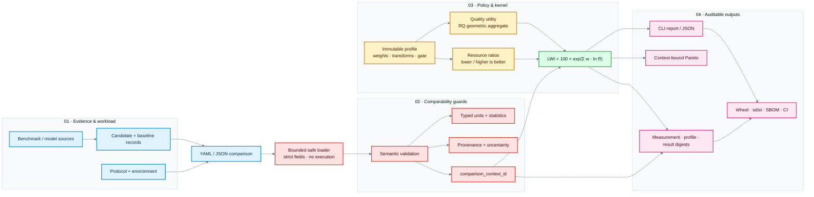

# LLM Weissman Index (LWI)

**LWI is a workload-specific relative quality-adjusted efficiency index, not a
universal intelligence ranking.** It compares a candidate system with an
explicit baseline under one versioned workload, protocol, profile, and
measurement context.

## Why it exists

Inference systems trade quality against latency, throughput, memory, energy,
cost, and other deployment resources. LWI makes that trade explicit while
refusing to turn incompatible measurements or arbitrary benchmark scores into
a single leaderboard number.

The baseline is **100** by definition. A score above 100 means that the
candidate is better under the selected profile and context; it does not mean
that the candidate is generally smarter or better.

Scores from different workloads, baselines, profiles, protocol versions, or
quality transforms must not be ranked together. Every result includes a
deterministic `comparison_context_id` to make that boundary auditable.

## Quick start

```bash
uv sync --locked
uv run lwi validate examples/synthetic/comparison.yaml
uv run lwi compute examples/synthetic/comparison.yaml --profile profiles/edge-v1.yaml --json
uv run lwi report examples/synthetic/comparison.yaml --profile profiles/edge-v1.yaml
uv run lwi context examples/synthetic/comparison.yaml --profile profiles/edge-v1.yaml
```

The normal local gate is:

```bash
uv lock --check
uv sync --locked
uv run ruff check .
uv run ruff format --check .
uv run pytest
uv build --no-sources
```

## Architecture at a glance

The reference path is intentionally auditable: evidence enters through a
bounded parser, policy and comparability guards run before mathematics, and
every report carries the identities needed to reproduce its context.



## Formula

For each quality task, LWI first maps the raw score to a documented positive
dimensionless utility. It then computes a weighted geometric quality ratio:

```text
ln(RQ) = Σ_i v_i · ln(u_candidate_i / u_baseline_i)
```

For each lower-is-better resource `x`, `R = baseline / candidate`; for a
higher-is-better metric, `R = candidate / baseline`. The kernel is:

```text
LWI = 100 · exp(wQ · ln(RQ) + Σ_j wj · ln(Rj))
```

All weights are non-negative and sum to one. Missing required metrics are
`incomplete`; they are never silently reweighted. A quality gate can make a
result `ineligible` even when the measured quality and resource ratios are
available.

## Quality and provenance

Raw benchmark scores are not assumed to be ratio-scale. Each profile declares
the scale type, direction, valid range, versioned utility transform, and
utility bounds. If no defensible transform exists, LWI refuses to score the
quality component.

Every observation carries units, statistic, and uncertainty fields where
available. Results preserve model revisions, benchmark revisions, environment
metadata, evidence class, source information, raw/config/environment digests,
profile digest, measurement digests, and result digest.

## Profiles and limitations

`param-v1`, `edge-v1`, and `api-v1` are explicit project policies, not natural
laws. Released profiles are immutable; changed scoring semantics require a new
profile or specification version. Parameter totals, active parameters, and
trainable parameters are separate fields, and disputed claims are not silently
resolved.

See the formal specification in [`spec/LWI-SPEC.md`](spec/LWI-SPEC.md), the
methodology and threat model in [`docs/`](docs/), and the synthetic and
GLiNER2.5-Decide examples in [`examples/`](examples/).

## Raw metrics and interpretation

Reports show raw candidate/baseline observations, canonical units, resource
ratios, quality utilities, retention, gate margin, warnings, evidence classes,
measurement digests, and the result digest. Human output is rounded for
readability; JSON retains Decimal strings and never rounds intermediate ratios.

Eligible results also expose a log-space contribution ledger: each dimension
reports its ratio, weight, and `weight * ln(ratio)`, followed by the sum. This is
an audit aid, not an additional score. `uncertainty_status` is `unavailable`
when the preserved observations do not support a defensible interval.

Performance evidence is explicit rather than a generic `throughput` context.
Use `offline`, `open_loop`, or `closed_loop` scenarios and preserve observed
`OperatingPoint`/`OperatingEnvelope` records. `TTFT`, `TPOT`, `ITL`, queue, and
E2E latency are separate semantics. Goodput is derived only from request traces
and an explicit SLO; failures, retries, cache state, token shape, and client
headroom remain visible. Interpolated points are never default score inputs.

Scalar LWI is a convenience layer. When multiple eligible records share one
context, `lwi pareto FILE... --profile PROFILE` exposes reusable raw-dimension
dominance flags. It refuses incompatible contexts.

## Reproducibility and security

Input data is untrusted: parsing uses bounded `safe_load`/JSON, strict fields,
an explicit unit registry, and no code execution. Provenance URLs are recorded
but never fetched. Generate a locked-environment CycloneDX SBOM with:

```bash
uv export --locked --format cyclonedx1.5 --output-file sbom.cdx.json
```

See [`docs/reproducibility.md`](docs/reproducibility.md),
[`docs/security-model.md`](docs/security-model.md), and
[`docs/threats-to-validity.md`](docs/threats-to-validity.md) before treating a
number as evidence.

The repository has no live load generator. `LiveBenchmarkPolicy` and
`schemas/live-benchmark.schema.json` are default-deny declarative preflight
contracts only. They cannot execute a shell command, Python expression, or
network request. External artifacts use explicit field mappings with source
tool/version and raw artifact digests; similar metric names are not semantic
proof.

## Prior art and independence

LWI is inspired by the historical Weissman Score associated with compression
work prepared by Tsachy Weissman and Vinith Misra for the HBO *Silicon Valley*
context. This repository is independent and claims no affiliation with them,
Stanford University, HBO, MLCommons, Fastino, Hugging Face, or any model
vendor. During the prior-art review dated 2026-09-25, no established public
metric under the exact name “LLM Weissman Index” was found; adjacent work is
listed in [`docs/prior-art.md`](docs/prior-art.md).

## License

Apache-2.0. See [`NOTICE.md`](NOTICE.md) for independence and attribution
boundaries.
